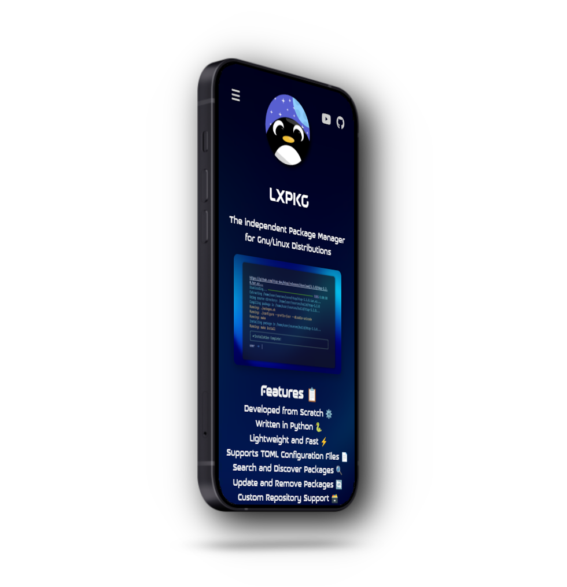

  

  <h2 style="font-size: 74px;">
    <strong>
      <a href="https://learnixos.github.io/" style="text-decoration: none; color: inherit;">
        𝗟𝗲𝗮𝗿𝗻𝗶𝘅𝗢𝗦
      </a>
    </strong>
  </h2>

    <!-- Creates extra space -->

<h1>
  
</h1>

    <!-- Creates extra space -->

  
  ## A distribution that 🐧:
  #### Is aligned with scalability and accessibility, meant specifically for inexperienced users. 🍉
  #### Is pre-configured for an i3 and Cinnamon desktop respectively. 🧖‍♂️
  
    <!-- Creates extra space -->

  <h1>
    
  </h1>

  <!-- Creates extra space -->

  
  ## Reasons to use 𝗟𝗲𝗮𝗿𝗻𝗶𝘅𝗢𝗦 🐧:

  #### LXOS is designed to be easy to configure for new and experienced users alike. 🥝
  #### LXOS is scalable and unique in its implementations, focusing on user-preference and efficiency. 💆‍♂️
  #### Documentation is provided via Github, Youtube, and the OS itself. 🎴
  #### Why not? You watched LearnixTV, I would trust the OS made after him! 🐧

  
    <!-- Creates extra space -->
    <!-- Creates extra space -->

## **Thanks to the contributions of:**
  - Ping (Opposite34) | Current Head Maintainer of the LearnixOS website
  - (coming soon)

# **Status**

